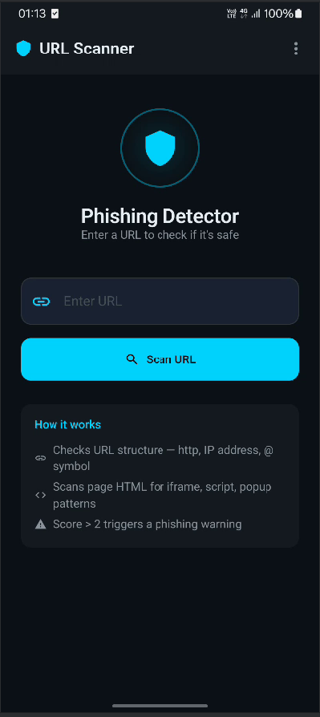
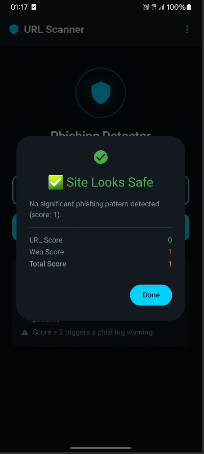

<div align="center">

# 🛡️ URL Scanner — Phishing Detector

**Aplikasi Android untuk mendeteksi situs phishing secara real-time**


*Dibuat sebagai Skripsi (2018) · Direfactor ke Clean Architecture + Jetpack Compose (2026)*

</div>

---

## 📱 Screenshots

> **Catatan:** Jalankan aplikasi di emulator/device dan ganti placeholder ini dengan screenshot hasil tangkapan layar.

| Main Screen | Phishing Detected | Site is Safe |
|::|::|::|
| *[Main Screen Screenshot]* | *[Phishing Warning Screenshot]* | *[Safe Result Screenshot]* |

---

## 📖 Tentang Aplikasi

**URL Scanner** adalah aplikasi Android yang menganalisis sebuah URL dan mendeteksi apakah URL tersebut merupakan **situs phishing** (penipuan online) atau aman untuk dikunjungi.

Aplikasi menggunakan pendekatan **rule-based scoring** dengan dua dimensi analisis:
1. **Struktur URL** — apakah URL memiliki tanda-tanda mencurigakan
2. **Konten HTML** — apakah source code halaman web mengandung elemen yang biasa digunakan oleh phisher

Jika total skor `> 2`, maka situs dianggap sebagai **phishing**.

---

## 🚀 Fitur Utama

- 🔍 **Scan URL Secara Real-time** — masukkan URL dan langsung dapatkan hasil analisis
- 📋 **Score Breakdown** — menampilkan skor URL dan skor HTML secara terpisah
- 🔗 **Share Intent** — bisa menerima URL dari browser atau aplikasi lain via Share
- 🌐 **Intent Filter** — aplikasi terdaftar sebagai handler untuk URL `http://` dan `https://`
- 🎨 **Dark Cybersecurity Theme** — UI modern dengan tema gelap bernuansa keamanan siber
- 📄 **Halaman About & Contact** — informasi developer dan cara kerja deteksi

---

## 🧠 Algoritma Deteksi

### 1. Analisis URL (`UrlFeatureAnalyzer`)

| Indikator | Deskripsi | Skor |
|-----------|-----------|------|
| `http://` | URL menggunakan HTTP (tidak aman, bukan HTTPS) | +1 |
| `@` symbol | Ada karakter `@` dalam URL (trik redirect berbahaya) | +1 per `@` |
| IP Address | Domain berupa IP address bukan nama domain | +1 |

### 2. Analisis Konten HTML (`WebHtmlAnalyzer`)

| Indikator | Deskripsi | Skor |
|-----------|-----------|------|
| `<script src>` | Ada external script yang dimuat | +1 |
| `<iframe>` | Ada iframe tersembunyi | +1 |
| `` | Ada gambar external (umum di phishing) | +1 |
| Email address | Ada alamat email dalam HTML | +1 |
| `window.open` | Ada popup JavaScript | +1 |

### Hasil Penilaian

```
Total Score = URL Score + Web Score.

Score ≤ 2  →  ✅ "Site Looks Safe"
Score > 2  →  ⚠️ "Phishing Detected!"
```

---

## 🏗️ Arsitektur

Proyek ini menggunakan **Clean Architecture** yang terdiri dari 3 layer utama:

```
┌─────────────────────────────────────────┐
│            UI Layer (Compose)           │
│  MainScreen · AboutScreen · Contact     │
│  AppNavigation · URLScannerTheme        │
├─────────────────────────────────────────┤
│          Presentation Layer             │
│  ScanViewModel · ScanUiState            │
│  ScanViewModelFactory (Manual DI)       │
├─────────────────────────────────────────┤
│             Domain Layer                │
│  AnalyzeUrlUseCase                      │
│  UrlAnalyzer (interface)                │
│  WebContentAnalyzer (interface)         │
│  WebContentRepository (interface)       │
│  PhishingResult (model)                 │
├─────────────────────────────────────────┤
│              Data Layer                 │
│  WebContentRepositoryImpl (OkHttp)      │
│  UrlFeatureAnalyzer · WebHtmlAnalyzer   │
└─────────────────────────────────────────┘
```

---

## 🧱 SOLID Principles

| Prinsip | Penerapan |
|---------|-----------|
| **S** — Single Responsibility | `UrlFeatureAnalyzer` hanya cek URL; `WebHtmlAnalyzer` hanya cek HTML; `ScanViewModel` hanya manage UI state |
| **O** — Open/Closed | Analyzer baru cukup implementasi interface, tanpa ubah `AnalyzeUrlUseCase` |
| **L** — Liskov Substitution | `UrlFeatureAnalyzer` dapat dipakai di mana pun `UrlAnalyzer` diharapkan |
| **I** — Interface Segregation | `UrlAnalyzer` dan `WebContentAnalyzer` dipisah — bukan satu interface besar |
| **D** — Dependency Inversion | `AnalyzeUrlUseCase` bergantung pada *interface* bukan implementasi konkret |

---

## 📁 Struktur Project

```
com.example.urlscanner
├── MainActivity.kt
├── domain/
│   ├── model/
│   │   └── PhishingResult.kt
│   ├── analyzer/
│   │   ├── UrlAnalyzer.kt          (interface)
│   │   ├── WebContentAnalyzer.kt   (interface)
│   │   ├── UrlFeatureAnalyzer.kt   (implementation)
│   │   └── WebHtmlAnalyzer.kt      (implementation)
│   ├── repository/
│   │   └── WebContentRepository.kt (interface)
│   └── usecase/
│       └── AnalyzeUrlUseCase.kt
├── data/
│   └── repository/
│       └── WebContentRepositoryImpl.kt
├── presentation/
│   ├── ScanUiState.kt
│   ├── ScanViewModel.kt
│   └── ScanViewModelFactory.kt
└── ui/
    ├── theme/
    │   ├── Color.kt
    │   ├── Type.kt
    │   └── Theme.kt
    ├── navigation/
    │   └── AppNavigation.kt
    └── screen/
        ├── MainScreen.kt
        ├── AboutScreen.kt
        └── ContactScreen.kt
```

---

## 🛠️ Tech Stack

| Teknologi | Versi | Kegunaan |
|-----------|-------|---------|
| **Kotlin** | 2.1.0 | Bahasa pemrograman utama |
| **Jetpack Compose** | 1.7.6 | UI framework modern deklaratif |
| **Material3** | 1.3.1 | Design system & UI components |
| **Navigation Compose** | 2.8.5 | In-app navigation antar screen |
| **ViewModel** | 2.8.7 | UI state management |
| **Kotlin Coroutines** | 1.9.0 | Asynchronous background operations |
| **OkHttp** | 4.12.0 | HTTP client untuk fetch HTML |
| **AGP** | 8.6.0 | Android Gradle Plugin |
| **Gradle** | 8.9 | Build system |

---

## ⚡ Perbandingan: Sebelum vs Sesudah Refactor

| Aspek | Sebelum (2018) | Sesudah (2026) |
|-------|---------------|----------------|
| Bahasa | Java | Kotlin |
| UI | XML Layout + Activity | Jetpack Compose |
| Threading | `StrictMode.permitAll()` 😱 | Kotlin Coroutines |
| Network | Apache HttpClient (deprecated) | OkHttp 4 |
| State | Tidak ada | `StateFlow<ScanUiState>` |
| Architecture | Tidak ada | Clean Architecture |
| Navigation | Multiple Activities | Compose Navigation |
| minSdk | 17 | 21 |
| Gradle | 3.3 | 8.9 |

---

## ⚙️ Requirements

- **Android Studio** Ladybug (2024.2.1) atau lebih baru
- **JDK 17**
- **Android device / emulator** dengan API level **21** (Android 5.0) atau lebih baru
- Koneksi internet (untuk fetch HTML dari URL target)

---

## 🔧 Instalasi & Menjalankan

### 1. Clone repository

```bash
git clone https://github.com/eko8757/URL_Scanner.git
cd URL_Scanner
```

### 2. Buka di Android Studio

```
File → Open → Pilih folder URL_Scanner-master
```

### 3. Sync Gradle

```
File → Sync Project with Gradle Files
```

### 4. Build & Run

```bash
# Via terminal
./gradlew assembleDebug

# Install ke device
./gradlew installDebug
```

Atau klik tombol **▶️ Run** di Android Studio.

---

## 🔒 Permissions

| Permission | Alasan |
|------------|--------|
| `INTERNET` | Fetch HTML dari URL yang di-scan |
| `ACCESS_NETWORK_STATE` | Cek status koneksi internet |

---

## 📝 Cara Penggunaan

### Method 1: Input Manual
1. Buka aplikasi **URL Scanner**
2. Ketik URL di field input (contoh: `http://192.168.1.1/login`)
3. Tap tombol **"Scan URL"**
4. Lihat hasil analisis di dialog

### Method 2: Share dari Browser
1. Buka URL di browser mana pun
2. Tap **Share** → pilih **URL Scanner**
3. URL otomatis terisi dan siap di-scan

---

## 🧪 Test Cases

| URL | Hasil yang Diharapkan | Alasan |
|-----|-----------------------|--------|
| `https://www.google.com` | ✅ Safe (score ≤ 2) | HTTPS, domain valid |
| `http://www.google.com` | ⚠️ Kemungkinan warning | HTTP: +1 |
| `http://192.168.1.1/login` | ⚠️ Phishing (score > 2) | HTTP: +1, IP address: +1, web content |
| `http://login@evil.com` | ⚠️ Phishing | HTTP: +1, @ symbol: +1 |

---

## 👨‍💻 Developer

**Eko Murdiansyah**
- 📧 Email: eko8757@example.com
- 🐙 GitHub: [@eko8757](https://github.com/eko8757)

*Proyek ini awalnya dibuat sebagai **Skripsi** di tahun 2018, kemudian direfactor pada 2026 untuk menerapkan Clean Architecture, SOLID principles, dan teknologi Android modern (Jetpack Compose).*

---

## 📄 License

```
MIT License

Copyright (c) 2018-2026 Eko Murdiansyah

Permission is hereby granted, free of charge, to any person obtaining a copy
of this software and associated documentation files (the "Software"), to deal
in the Software without restriction, including without limitation the rights
to use, copy, modify, merge, publish, distribute, sublicense, and/or sell
copies of the Software, and to permit persons to whom the Software is
furnished to do so, subject to the following conditions:

The above copyright notice and this permission notice shall be included in all
copies or substantial portions of the Software.
```

---

<div align="center">

⭐ **Jika project ini bermanfaat, berikan bintang ya!** ⭐

*Made with ❤️ + Kotlin + Jetpack Compose*

</div>
